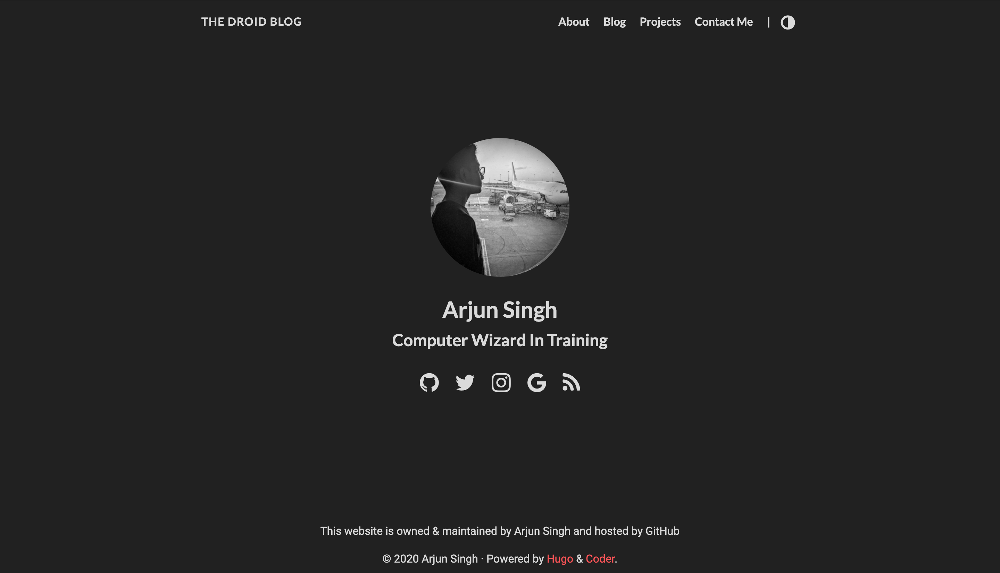

# Overview

This repository is a repository meant to contain the source files that I will use in order to construct [my blog website](https://arjdroid.github.io). My website is constructed using the [hugo website construction engine](https://gohugo.io), a tool that takes .md files as input and uses them, along side a theme, to generate multiple static html pages within a master directory that can be used as a static website.
  
