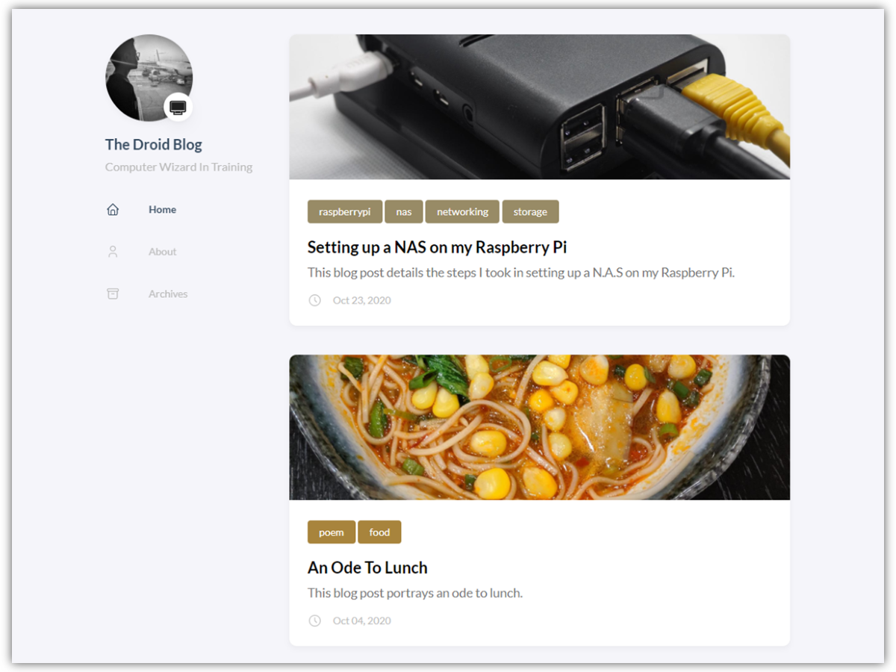
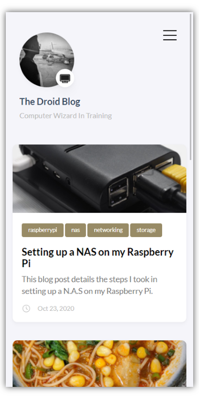
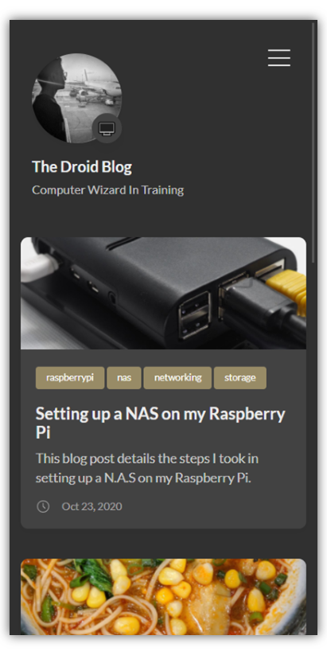
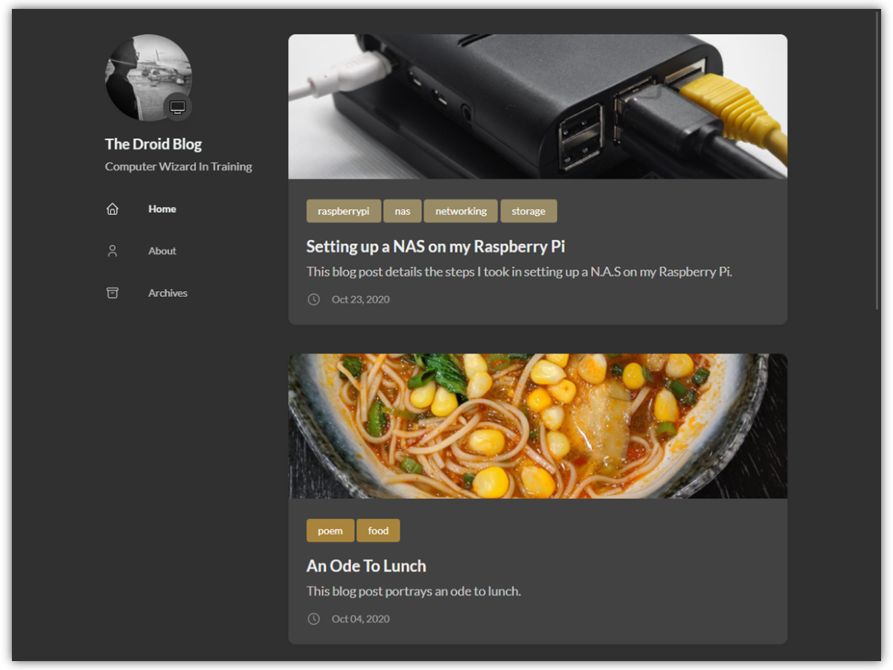

# the_droid_blog-source_files

> A repository that contains the source files for [my blog website](https://arjdroid.github.io), built with [hugo](https://gohugo.io).

<i>A screenshot of the website's landing page in light mode when viewed on a 4:3 screen horizontally.</i>

## Overview

This repository is a repository meant to contain the source files that I will use in order to construct [my blog website](https://arjdroid.github.io). My website is constructed using the [hugo website construction engine](https://gohugo.io), a tool that takes .md files as input and uses them, along side a theme, to generate multiple static html pages within a master directory that can be used as a static website.
  
## Flexibility

The static pages built with the [hugo engine](https://gohugo.io) are very flexible in terms of their appearance and the devices which they can be viewed upon. The specific hugo theme which I have used, [hugo coder](https://themes.gohugo.io/hugo-coder/), is a theme which contains [javascript](https://www.w3schools.com/js/DEFAULT.asp) code that allows the whole site to switch between dark mode and light mode. The site can adapt and change its size in order to be suitable to be viewed upon almost any device.

### Screenshots

<i>A screenshot of the website's landing page in light mode, viewed on a phone.</i>

 

<i>A screenshot of the website's landing page in dark mode, viewed on a phone.</i>

 

<i>A screenshot of the website's landing page in dark mode when viewed on a 4:3 screen horizontally.</i>

